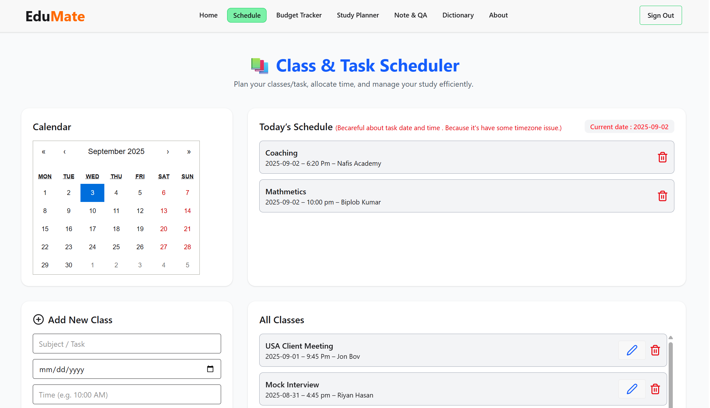
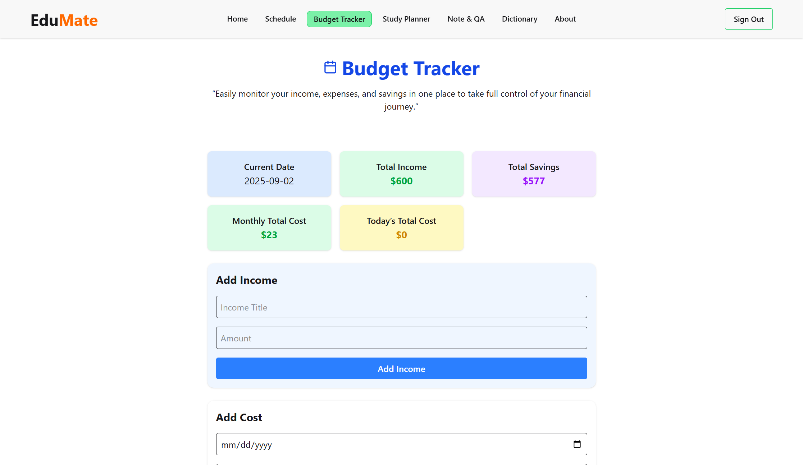
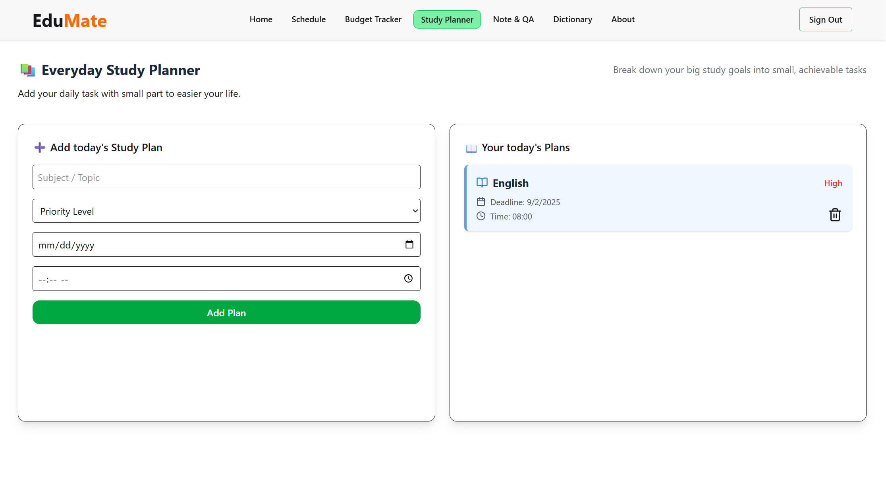
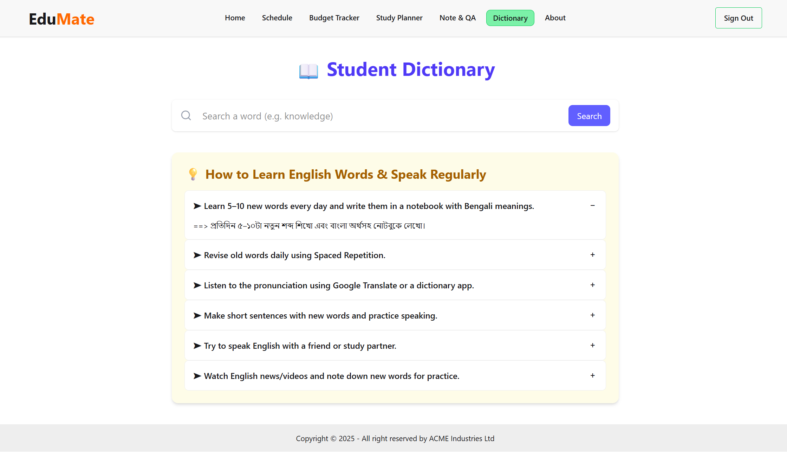
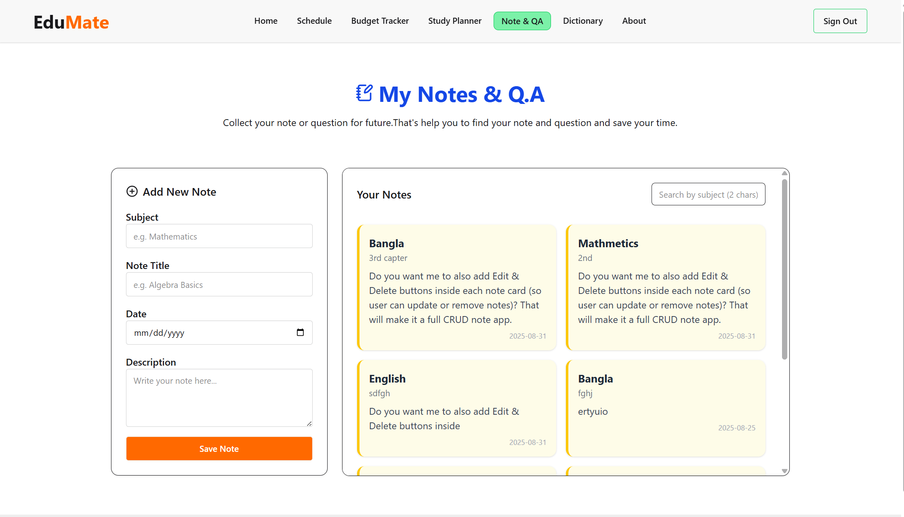

# 🎓 EduMate – Student Toolkit

EduMate is a **full-stack MERN application** designed to make student life easier by providing essential tools like class scheduling, budget tracking, and productivity utilities.  
With EduMate, students can manage their academic and personal tasks all in one place.  

---

## 🚀 Tech Stack

**Frontend:** React.js, Tailwind CSS, DaisyUI  
**Backend:** Node.js, Express.js, MongoDB  
**Authentication:** JWT / Firebase Auth  
**Other Tools:** Axios, TanStack Query, SweetAlert2  

---

## 📌 Features

### 🗓️ Class Scheduler
- Add, update, and delete classes with subject, date, time, and instructor.  
- View **Today’s Tasks** to stay on track.  
- Automatically highlights current-day classes.  

### 💰 Budget Tracker
- Add and categorize your **income and expenses**.  
- Get a **clear overview of your financial habits**.  
- Helps students stay within budget and save money.  
- 💡 **Unique Feature:** Real-time balance calculation with visual insights.  

### 📋 Notes & Productivity Tools
- Save personal study notes.  
- Organize tasks and improve productivity.  

### 🎨 Clean & Modern UI
- Minimal, distraction-free design built with Tailwind + DaisyUI.  
- Fully responsive for both desktop and mobile devices.  

### 📚 Private Routes & Authentication
- Secure authentication for users.  
- Only logged-in users can access private tools (Schedules, Budget, Notes, etc.).  
- Handles unauthorized access with **automatic redirects**.

---

## 🌟 Unique Features

✅ **Dictionary :**  
-  Quick Learning Support
   --Students can instantly look up meanings, synonyms, antonyms, and usage without leaving the app.
   --Saves time compared to switching between multiple apps/websites.

- Boosts Vocabulary
  --Daily word suggestions or "Word of the Day" help students gradually expand their vocabulary.

- Better Contextual Understanding
  --Helps in understanding difficult words from study notes, assignments, or reference books

- Unique Value Add
  --Makes your toolkit more than just a task manager → it becomes an all-in-one student companion app.

---

# [Visit live site link]( https://edumate-web.netlify.app/ )

## 📷 Screenshots

> Replace the following placeholders with your actual project screenshots:

### Schedule page

### Budget Tracker

### Study Planer

### Dictionary

### Note & QA

---

